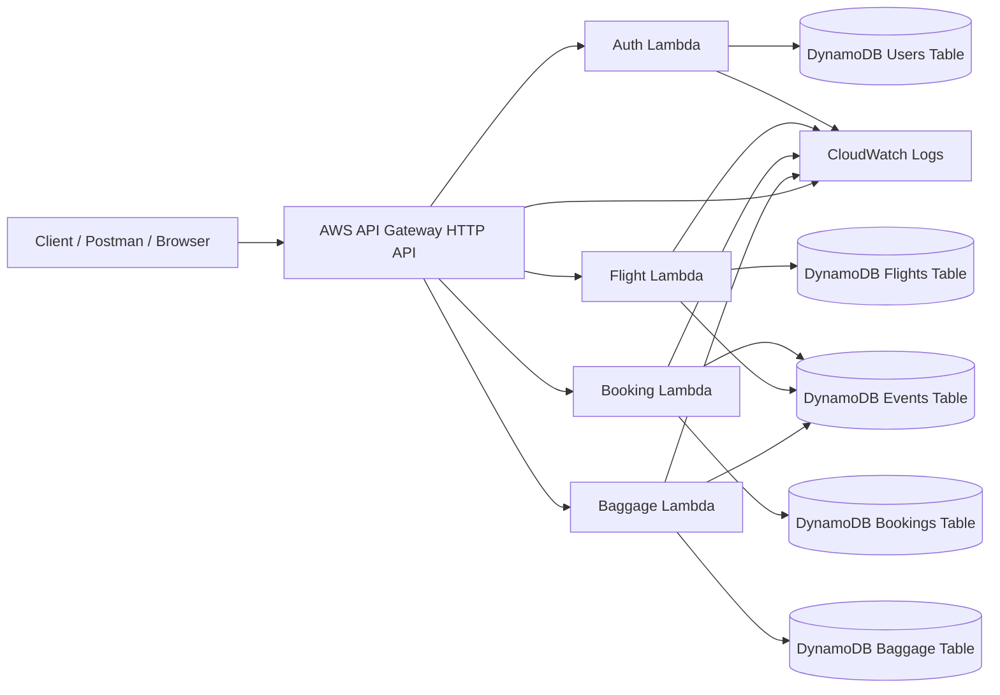
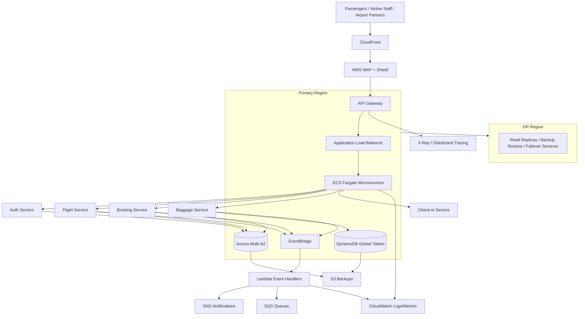

# AeroLink Airline Systems Platform — AWS Free Tier Project Plan

**Module:** COMP60010 Enterprise Cloud and Distributed Web Applications  
**Assignment:** ECDWA2 — AeroLink Airline Systems Platform  
**Goal:** Complete a cloud-based distributed web application with strong implementation evidence, testing evidence, monitoring evidence, and a clear report/presentation package.

---

## 1. Assignment Target Summary

The assignment asks us to design, implement, and test a cloud-based distributed web application for AeroLink, a global airline systems platform. The system must address:

- High availability
- Global scalability
- Fault tolerance
- Real-time data synchronisation
- Secure APIs
- Cloud-native services
- Monitoring and observability
- Performance and scalability testing

The solution must include:

- Cloud-based architecture design
- Microservices
- Containerisation
- Serverless computing
- Cloud-managed databases
- API Gateway
- Swagger/OpenAPI documentation
- Secure service-to-service communication
- Encryption, JWT, RBAC, GDPR and PCI-DSS discussion
- Event-driven updates for seats, baggage, schedule, and pricing
- Retry, circuit breaker, load balancing, scaling, and disaster recovery strategy
- Unit, integration, API, load, and stress testing evidence
- Final report, source code ZIP, and presentation slides

---

## 2. Current Project Starting Point

Current project already has:

- FastAPI-based microservices
- `auth_service`
- `flight_service`
- `booking_service`
- `event_consumer`
- RabbitMQ event messaging
- Docker and Docker Compose
- Basic JWT login/register
- Basic health endpoints
- API Gateway added in Phase 1

Current project still needs:

- Stronger internal service security
- Real RBAC enforcement
- Baggage service
- Schedule/pricing event flow
- Better event publishing
- Cloud deployment evidence
- AWS API Gateway / Lambda / DynamoDB / CloudWatch evidence
- Unit and integration tests
- Postman collection
- Performance testing with Locust or k6
- Monitoring and tracing evidence
- Final report and slides

---

## 3. Recommended AWS Free Tier Strategy

To keep cost low and still score well, we will use two layers:

### 3.1 Local Implementation Layer

This proves microservices, Docker, REST APIs, RabbitMQ, gateway routing, and local testing.

Use:

- FastAPI
- Docker Compose
- RabbitMQ
- PostgreSQL or SQLite for local prototype
- Pytest
- Postman
- Locust

### 3.2 AWS Free Tier Practical Evidence Layer

This proves cloud implementation and monitoring without creating expensive infrastructure.

Use:

- AWS IAM
- AWS API Gateway HTTP API
- AWS Lambda
- Amazon DynamoDB
- Amazon S3
- Amazon CloudWatch
- AWS CloudTrail
- AWS Budgets
- CloudFormation or AWS SAM

### 3.3 AWS Architecture Design Layer

This is for the report and architecture diagram. It can include enterprise-level services even if not all are deployed because the assignment asks for design and justification.

Include in architecture:

- Amazon VPC
- Public/private subnets
- API Gateway
- ECS Fargate for containerised services
- AWS Lambda for event-driven functions
- Amazon Aurora for relational booking/payment/check-in data
- DynamoDB for fast baggage/seat/event status lookups
- EventBridge or SQS/SNS for events
- CloudWatch and X-Ray for observability
- WAF and Shield for edge protection
- KMS for encryption
- Route 53 and CloudFront for global access
- Multi-region disaster recovery design

---

## 4. Final Architecture Direction

### 4.1 Practical AWS Demo Architecture



### 4.2 Full Enterprise Target Architecture for Report



---

## 5. Implementation Phases

## Phase 0 — AWS Account and Safety Setup

**Goal:** Prepare AWS safely before creating resources.

Tasks:

- Create or access AWS Free Tier / AWS Educate account
- Enable MFA on root account
- Create IAM admin user for daily work
- Create IAM least-privilege role for Lambda
- Create AWS Budget alert, suggested limit: USD 1 or USD 5
- Check Free Tier dashboard
- Choose primary region: `ap-south-1` Mumbai or `us-east-1` N. Virginia
- Create project folder for screenshots and evidence

Evidence screenshots:

- AWS account dashboard
- MFA enabled proof
- IAM user/role page
- Budget alert page
- Free Tier usage page

Cost safety rule:

- Do not create NAT Gateway, Aurora, OpenSearch, SageMaker notebook, or ECS Fargate until we intentionally decide.
- Delete all test resources after screenshots if they are not needed.

---

## Phase 1 — Local Project Completion

**Goal:** Make the current microservices project technically strong.

Tasks:

- Finalise API Gateway service
- Secure internal APIs with JWT validation
- Enforce RBAC rules
- Add `baggage_service`
- Add `schedule_service` or schedule endpoints in flight service
- Add event publishing:
  - `SEAT_RESERVED`
  - `BOOKING_CONFIRMED`
  - `BAGGAGE_STATUS_UPDATED`
  - `FLIGHT_SCHEDULE_UPDATED`
  - `PRICE_UPDATED`
- Add event consumer logs
- Add `.env.example`
- Improve README

Evidence screenshots:

- Docker containers running
- Gateway Swagger page
- Auth login token response
- Protected route returning 401 without token
- RBAC route returning 403 for wrong role
- Successful booking
- RabbitMQ event queue messages

---

## Phase 2 — AWS Serverless Demo

**Goal:** Build a small working AWS cloud version using Free Tier-friendly services.

Services:

- API Gateway HTTP API
- Lambda functions
- DynamoDB tables
- CloudWatch logs
- IAM roles

Lambda functions:

- `aerolink-auth-lambda`
- `aerolink-flight-lambda`
- `aerolink-booking-lambda`
- `aerolink-baggage-lambda`
- `aerolink-event-lambda`

DynamoDB tables:

- `AeroLinkUsers`
- `AeroLinkFlights`
- `AeroLinkBookings`
- `AeroLinkBaggage`
- `AeroLinkEvents`

API Gateway routes:

- `POST /auth/register`
- `POST /auth/login`
- `GET /flights`
- `POST /flights`
- `PATCH /flights/{flightId}/price`
- `POST /bookings`
- `GET /bookings/{bookingId}`
- `POST /baggage`
- `PATCH /baggage/{bagId}/status`
- `GET /events`

Evidence screenshots:

- Lambda function list
- Lambda code/configuration
- API Gateway route list
- DynamoDB tables and sample records
- Postman successful API test
- CloudWatch logs showing function execution
- CloudTrail showing API activity

---

## Phase 3 — Security and Compliance

**Goal:** Strengthen the report and implementation security marks.

Implementation tasks:

- JWT authentication
- RBAC roles: `passenger`, `staff`, `admin`
- IAM least-privilege policies
- DynamoDB encryption at rest using AWS-managed keys or KMS
- HTTPS via API Gateway default endpoint
- Input validation
- No hardcoded secrets in GitHub
- Environment variables for secrets

Report discussion:

- GDPR:
  - Data minimisation
  - Right to erasure
  - Audit trail
  - Encryption
  - Regional data residency
- PCI-DSS:
  - Do not store card data
  - Use third-party payment provider/tokenisation
  - Encrypt payment-related metadata
  - Strict IAM and audit logging
- Consistency:
  - Use Saga pattern for booking and seat reservation
  - Use eventual consistency for baggage tracking and notifications
  - Use strong consistency where needed for seat count updates

Evidence screenshots/files:

- IAM policy JSON
- Lambda execution role
- CloudTrail event logs
- DynamoDB encryption settings
- Protected API test

---

## Phase 4 — Fault Tolerance and Resilience

**Goal:** Cover retry, circuit breaker, auto-scaling, load balancing, HA, and DR.

Implementation tasks:

- Retry logic in booking service
- Circuit breaker in service-to-service calls
- Idempotency key for booking requests
- Graceful error response format
- Health endpoints for every service
- Timeout handling

AWS explanation:

- Lambda automatically scales per request
- API Gateway handles managed routing
- DynamoDB can scale with on-demand capacity
- Multi-AZ is handled by managed services
- Enterprise design uses ECS Fargate across private subnets and ALB across multiple AZs
- Disaster recovery uses S3 backups, DynamoDB global tables, Aurora read replicas/backups, and Route 53 failover

Evidence:

- Failed downstream service test
- Retry/circuit breaker log output
- CloudWatch error log screenshot
- Report diagram showing HA and DR

---

## Phase 5 — Monitoring and Observability

**Goal:** Show CloudWatch, logs, metrics, and tracing.

Implementation tasks:

- Add structured JSON logs
- Add request ID/correlation ID
- Log every important event:
  - login
  - flight created
  - booking created
  - seat reserved
  - baggage updated
- Use CloudWatch Logs for Lambda
- Optional: enable API Gateway access logging
- Optional: add AWS X-Ray tracing

Evidence screenshots:

- CloudWatch log group list
- CloudWatch logs for each Lambda
- API Gateway metrics
- Lambda invocation count
- Lambda error count
- CloudTrail API activity

---

## Phase 6 — Testing Strategy

**Goal:** Cover the 20% testing/results mark properly.

Test types:

### 6.1 Unit Testing

Use `pytest` for local services.

Test examples:

- Register user successfully
- Login returns JWT
- Invalid password fails
- Passenger cannot create flight
- Staff can create flight
- Booking reduces available seats
- Baggage status update creates event

### 6.2 Integration Testing

Test full flow:

1. Register user
2. Login
3. Create flight as staff
4. Book flight as passenger
5. Confirm seat count reduced
6. Update baggage status
7. Check event log

### 6.3 API Testing

Use Postman collection.

Evidence:

- Collection JSON file
- Successful test run screenshot
- Failed auth screenshot
- 401/403 screenshots

### 6.4 Performance Testing

Use Locust or k6.

Test scenarios:

- 10 users browsing flights
- 25 users booking flights
- 50 users mixed read/write requests
- Stress test until errors increase

Metrics to record:

- Average response time
- p95 response time
- Requests per second
- Error rate
- Throughput

Evidence:

- Locust dashboard screenshots
- CSV result files
- Discussion of bottlenecks and improvements

---

## Phase 7 — Deployment Automation

**Goal:** Include configuration and deployment files for marks.

Add:

- `template.yaml` for AWS SAM or CloudFormation
- IAM role policy JSON
- Deployment commands in README
- Optional GitHub Actions workflow

Suggested files:

```text
aws/
  template.yaml
  iam-policy.json
  deploy_steps.md
  cleanup_steps.md
postman/
  aerolink_collection.json
performance/
  locustfile.py
  results/
tests/
  test_auth.py
  test_flights.py
  test_bookings.py
  test_baggage.py
```

Evidence:

- CloudFormation/SAM successful deployment screenshot
- Stack resources screenshot
- Deployment command output

---

## Phase 8 — Final Report Plan

Suggested report structure:

1. Introduction
2. Case Study and Requirements Analysis
3. Proposed Cloud Architecture
4. Microservices and API Design
5. AWS Implementation Overview
6. Security, Compliance, and Data Consistency
7. Real-Time Synchronisation
8. Fault Tolerance and Resilience
9. Monitoring and Observability
10. Testing and Performance Evaluation
11. Challenges and Limitations
12. Future Improvements
13. Conclusion
14. References
15. Appendices

Recommended evidence appendix:

- Appendix A: Architecture diagram
- Appendix B: API documentation screenshots
- Appendix C: AWS deployment screenshots
- Appendix D: CloudWatch and CloudTrail screenshots
- Appendix E: Postman testing screenshots
- Appendix F: Unit/integration test results
- Appendix G: Locust performance test results
- Appendix H: Source code structure
- Appendix I: Deployment automation snippets

---

## Phase 9 — Presentation Plan

15-minute presentation, 10–15 slides:

1. Title and project overview
2. Problem and AeroLink requirements
3. Proposed cloud-native architecture
4. Microservices design
5. API Gateway and API documentation
6. Data storage and consistency strategy
7. Event-driven real-time synchronisation
8. Security and compliance
9. AWS implementation evidence
10. Monitoring and observability evidence
11. Testing and performance results
12. Fault tolerance and resilience
13. Challenges and improvements
14. Final outcome
15. Q&A / viva readiness

---

## 10. Evidence Checklist

### Local Evidence

- [ ] Docker containers running
- [ ] API Gateway Swagger page
- [ ] Auth login/register screenshot
- [ ] JWT protected endpoint test
- [ ] RBAC 403 screenshot
- [ ] Flight created screenshot
- [ ] Booking created screenshot
- [ ] Seat count reduced screenshot
- [ ] Baggage status update screenshot
- [ ] RabbitMQ queue/event screenshot
- [ ] Unit test result screenshot
- [ ] Integration test result screenshot
- [ ] Locust performance screenshot

### AWS Evidence

- [ ] MFA enabled
- [ ] IAM role/policy
- [ ] AWS Budget alert
- [ ] API Gateway routes
- [ ] Lambda function list
- [ ] DynamoDB tables
- [ ] DynamoDB sample records
- [ ] Postman test against AWS URL
- [ ] CloudWatch logs
- [ ] CloudWatch metrics
- [ ] CloudTrail activity
- [ ] CloudFormation/SAM stack
- [ ] Resource cleanup screenshot or notes

### Report Evidence

- [ ] Architecture diagram
- [ ] API documentation screenshot
- [ ] Security model table
- [ ] Consistency strategy explanation
- [ ] Resilience strategy table
- [ ] Testing results table
- [ ] Performance test graph/table
- [ ] Challenges and future improvements
- [ ] References

---

## 11. Suggested Mark-Focused Strategy

Assessment weighting:

| Area | Weight | Our Strategy |
|---|---:|---|
| Architecture Design | 20% | Strong AWS diagram, justification, HA, multi-region, scalability |
| Implementation | 40% | Working local microservices + AWS serverless demo + code ZIP |
| Testing and Results | 20% | Pytest, Postman, Locust, screenshots, result discussion |
| Presentation and Viva | 20% | Clear slides, evidence screenshots, confident explanation |

Main scoring focus:

1. Working software
2. Real AWS screenshots
3. Clear architecture justification
4. Security/RBAC evidence
5. Testing and performance results
6. Good explanation of cloud trade-offs

---

## 12. Cost-Control Checklist

Before creating AWS resources:

- [ ] Set billing alert
- [ ] Use one region only for practical implementation
- [ ] Use small Lambda functions
- [ ] Use DynamoDB on-demand carefully or provisioned small capacity
- [ ] Avoid NAT Gateway
- [ ] Avoid Aurora unless only used in architecture explanation
- [ ] Avoid OpenSearch unless only used in architecture explanation
- [ ] Avoid SageMaker unless using a short screenshot-only demo with cleanup
- [ ] Delete test resources after evidence capture

After every AWS work session:

- [ ] Check Billing Dashboard
- [ ] Check Free Tier usage
- [ ] Delete unused Lambda functions
- [ ] Delete unused API Gateway APIs
- [ ] Delete unused DynamoDB test tables if no longer needed
- [ ] Delete CloudWatch log groups if not needed

---

## 13. Step-by-Step Work Order

We will complete the assignment in this order:

1. Finalise local API Gateway and security
2. Add baggage service
3. Add full event-driven sync
4. Add tests
5. Add Postman collection
6. Add performance testing
7. Add monitoring/logging
8. Prepare AWS account safely
9. Deploy AWS serverless demo
10. Capture AWS evidence
11. Add CloudFormation/SAM deployment files
12. Write report sections one by one
13. Build final presentation slides
14. Prepare viva questions and answers
15. Final ZIP/package check

---

## 14. Immediate Next Task

Next task after this planning file:

**Step 1:** Open the project and update the code so the local microservices are complete:

- secure gateway
- enforce RBAC
- add baggage service
- add missing events
- add test structure

Then we will move to AWS setup safely.

---

## 15. Reference Links to Use in Report

Use official documentation where possible:

- AWS Free Tier: https://aws.amazon.com/free/
- AWS API Gateway Pricing: https://aws.amazon.com/api-gateway/pricing/
- AWS Lambda Pricing: https://aws.amazon.com/lambda/pricing/
- AWS CloudWatch Pricing: https://aws.amazon.com/cloudwatch/pricing/
- API Gateway + Lambda + DynamoDB tutorial: https://docs.aws.amazon.com/apigateway/latest/developerguide/http-api-dynamo-db.html
- AWS Well-Architected Framework: https://aws.amazon.com/architecture/well-architected/
- AWS Security Best Practices: https://docs.aws.amazon.com/security/
- GDPR official information: https://gdpr.eu/
- PCI DSS official website: https://www.pcisecuritystandards.org/

